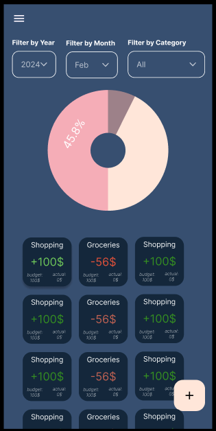
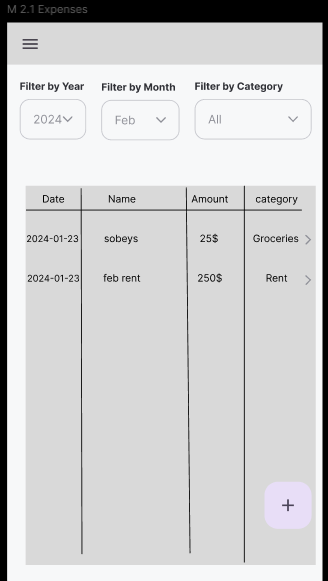
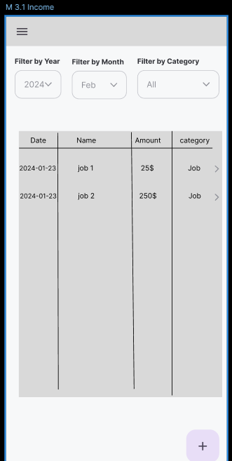
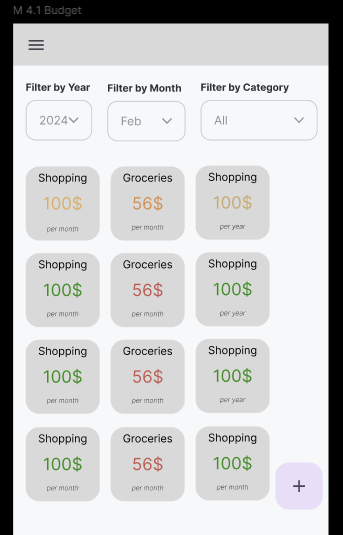
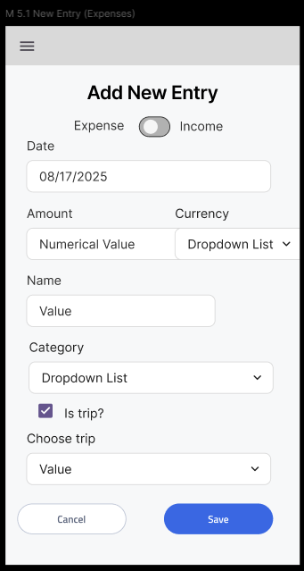
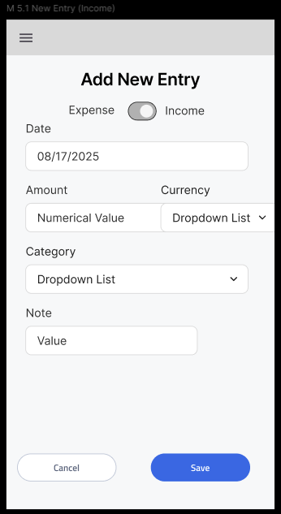
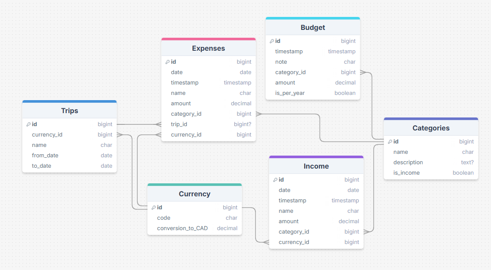

# Budget App

<!--
QUESTION:

- is it okay practice on the back-end to use a different route/endpoint to get info?
  (re: validate category id exists)

  - yes! can use a utils folder

- is it best practice to use IDs or names when referencing a different table in a request body?

  - IDs is good

- if i make a class on frontend for API service, is it best to have then three try/catch blocks?
  - just two is good -->

## Overview

What is your app? Give a brief description in a couple of sentences.

### Problem Space

I've never found a budget app or spreadsheet that is perfect. I want the option to add expenses offline, have separate trip expenses, and currencies.

### User Profile

- Users who are looking for a place to budget and track cash.

### Features

List the functionality that your app will include. These can be written as user stories or descriptions with related details. Do not describe _how_ these features are implemented, only _what_ needs to be implemented.

## Implementation

### Tech Stack

- React
- JavaScript
- Scss
- MySQL
- Express
- Client libraries:
  - react
  - react-router
  - axios
  - react-router-dom
- Server libraries:
  - express
  - knex

### APIs

No external APIs are used.

### Sitemap

- _Overview/Summary Page_ : This page will have some different representations of the data. It will include a PI Chart, table, info cards, etc. Anything that gives an idea of budgeting progress at a glance.
- _Add Entry Page_ : This will be a page or sidebar with a form to input either an Income or an Expense line.
- _Expenses Page_ : Table of all expense items. Filters at the top for year, month, category, etc.
- _Income Page_ : Table of all income items. Filters at the top for year, month, category, etc.
- _Budget Page_ : View and edit all budget items
- _Record Information Page_ : after clicking on an expense or income line, this page will open up with more info and the option to edit the record
- _Settings Page_: Page to put the ugly stuff: to download data to csv file, dark/light themes, editing or adding categories, etc.

### Mockups

#### Summary Page:

#### Expenses Page:

#### Income Page:

#### Budget Page:

#### New Entry Page:

### Data

### Endpoints

1. Expenses Routes (`http:localhost:8080/api/expense`)

- `get` all expense records
- `get` expense by id
- `post` new expense record
- `patch` edit expense record
- `delete` expense record

2. Income Routes (`http:localhost:8080/api/income`)

- `get` all income records
- `get` income by id
- `post` new income record
- `patch` edit income record
- `delete` income record

3. Categories Routes (`http:localhost:8080/api/category`)

- `get` all Expense categories
- `get` all Income categories
- `get` category by id
- `post` new category
- `delete` category

4. Budget Routes (`http:localhost:8080/api/budget`)

- `get` all budget lines
- `post` new budget line
- `patch` edit budget line
- `delete` budget line

5. Currency Routes (`http:localhost:8080/api/currency`)

- `get` all currency codes

6. Trips Routes

## Roadmap

### Back-End

_Goal: done by Feb 14th_

- [x] set up all tables
- [x] seed initial data
- [x] set up all base routes/endpoints
- [ ] test they all work as expected

### Front-End

(MVP)

- [ ] Functionality: _Goal: done by Feb 18th_
  - [x] API service class
  - [x] Summary/Overview Page
  - [x] Income Page
  - [x] Expense Page
  - [ ] Add Entry Page/SideBar
- [ ] Styling: _Goal: done by Saturday Feb 20th_
  - [x] Summary/Overview Page
  - [ ] Income Page
  - [ ] Expense Page
  - [ ] Add Entry Page/SideBar

### Testing

_Goal: done by Sunday Feb 23th_

- [ ] Test all pages, endpoints, situations
- [ ] Clean up code

### Add Other Features

- [ ] Budget Page
  - [ ] add / edit budget item
  - [ ] change overview/summary to reflect progress vs the budget
- [ ] Schedule monthly payments
- [ ] Icons for categories
- [ ] Animations
- [ ] Component Reusability

---

## Future Implementations

- Login / Multiple users
- Option to upload data
- Trips Tab / Separate expenses and budget
- Build out Currency (currently will just have default and only option as CAD)
