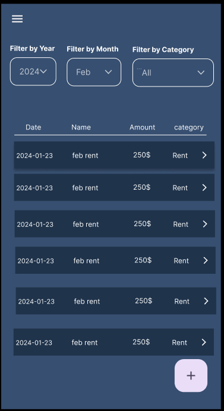
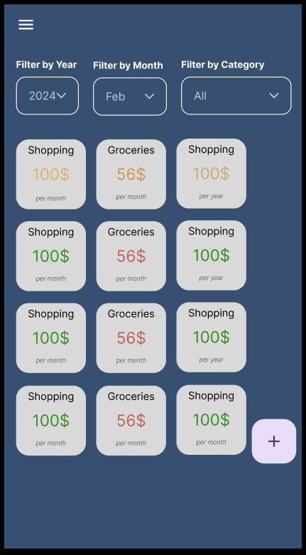

# Budget App

## Overview

Budgeting app: for expense tracking, comparing budget to actual amounts, and tracking income.

### Problem Space

I've never found a budget app or spreadsheet that is perfect. I want the option to add expenses offline, have separate trip expenses, and currencies.

## Implementation

### Tech Stack

- React
- JavaScript
- Scss
- MySQL
- Express
- Client libraries:
  - react
  - react-router
  - axios
  - react-router-dom
- Server libraries:
  - express
  - knex

### APIs

- Unsplash API for photo generation (https://unsplash.com/developers)

### Sitemap

- _Overview/Summary Page_ : This page will have some different representations of the data. It will include a PI Chart, table, info cards, etc. Anything that gives an idea of budgeting progress at a glance.
- _Add Entry Page_ : This will be a page or sidebar with a form to input either an Income or an Expense line.
- _Expenses Page_ : Table of all expense items. Filters at the top for year, month, category, etc.
- _Income Page_ : Table of all income items. Filters at the top for year, month, category, etc.
- _Budget Page_ : View and edit all budget items
- _Record Details Page_ : after clicking on an expense or income line, this page will open up with more info and the option to edit the record

Future Implementations:

- _Settings Page_: Page to put the ugly stuff: to download data to csv file, dark/light themes, editing or adding categories, etc.
- _Goals_ : Add expense / budget goals and track progress

### Mockups

#### Summary Page:

#### Expenses Page:

#### Income Page:

#### Budget Page:

#### New Entry Page:

### Data

### Endpoints

1. Expenses Routes (`http:localhost:8080/api/expense`)

- `get` all expense records
- `get` expense by id
- `post` new expense record
- `patch` edit expense record
- `delete` expense record

2. Income Routes (`http:localhost:8080/api/income`)

- `get` all income records
- `get` income by id
- `post` new income record
- `patch` edit income record
- `delete` income record

3. Categories Routes (`http:localhost:8080/api/category`)

- `get` all Expense categories
- `get` all Income categories
- `get` category by id
- `post` new category
- `delete` category

4. Budget Routes (`http:localhost:8080/api/budget`)

- `get` all budget lines
- `post` new budget line
- `patch` edit budget line
- `delete` budget line

5. Currency Routes (`http:localhost:8080/api/currency`)

- `get` all currency codes

6. Trips Routes

## Roadmap

### Back-End

_Goal: done by Feb 14th_

- [x] set up all tables
- [x] seed initial data
- [x] set up all base routes/endpoints
- [x] test they all work as expected

### Front-End

(MVP)

- [x] Functionality: _Goal: done by Feb 18th_
  - [x] API service class
  - [x] Summary/Overview Page
  - [x] Income Page
  - [x] Expense Page
  - [x] Add Entry Page/SideBar
- [x] Styling: _Goal: done by Saturday Feb 20th_
  - [x] Summary/Overview Page
  - [x] Income Page
  - [x] Expense Page
  - [x] Add Entry Page/SideBar

### Testing

_Goal: done by Sunday Feb 23th_

- [x] Test all pages, endpoints, situations
- [x] Clean up code

### Add Other Features

- [x] Budget Page
  - [x] add budget item
  - [ ] edit budget item
  - [x] change overview/summary to reflect progress vs the budget
- [ ] Additional features for Form:
  - [ ] User chooses icons for categories
  - [ ] User chooses colours for categories
- [ ] Schedule monthly payments
- [ ] Animations
- [x] Component Reusability

---

## Future Implementations

- Login / Multiple users
- Option to upload and download data
- Trips Tab / Separate expenses and budget
- Build out Currency (currently has CAD as default throughout the app)
- Goals Page : track and set budget goals
